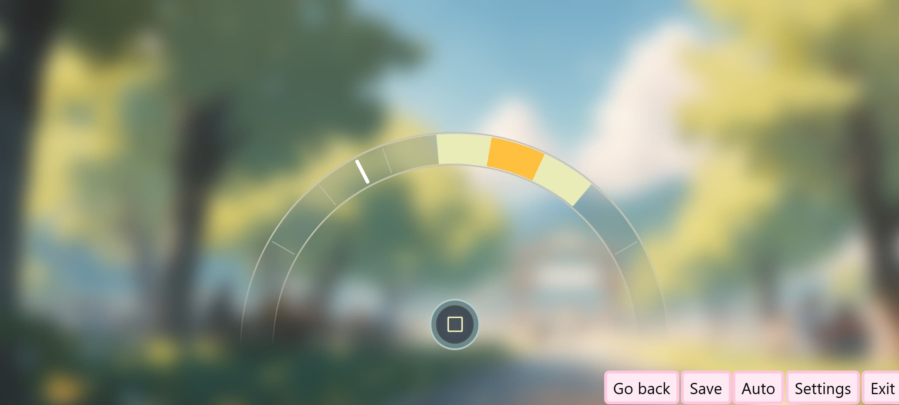

# @novely/moment-presser

Moment Presser is a custom action that requires an action from player. Specifically, pressing on button in time. When the moving indicator falls into the narrowest zone, a function is called, to which the state 'PERFECT' is passed, if the zone is thicker — 'PASS', and if it does not hit — 'MISS'. When the income reaches the end, the indicator returns back, and then moves forward again.

<div style="width: 100%; display: flex; justify-content: flex-start;">
  
</div>

## Usage

```ts
import type { CreateMomentPresserOptions } from '@novely/moment-presser';
import { createMomentPresser } from '@novely/moment-presser';
import '@novely/moment-presser/style.css';

import { extendAction } from '@novely/core';

const action = extendAction(engine.action, {
	momentPresser: (onPressed: CreateMomentPresserOptions<typeof engine.typeEssentials>['onPressed']) => {
		const momentPresser = createMomentPresser<typeof engine.typeEssentials>({
			onPressed: onPressed,
			translation: {
				en: {
					stop: 'Stop'
				}
			}
		})

		return ['custom', momentPresser];
	}
})

engine.script({
  start: [
    // you'r story goes here
    action.momentPresser((state, presserState) => {
      console.log(presserState) // 'PERFECT' | 'PASS' | 'MISS'

      // Function to receive or set state, see: https://novely.deno.dev/guide/state.html
      state()
    })
  ]
})
```

## CSS Properties

```css
:root {
  --moment-presser-main-arc-background: color;
  --moment-presser-inner-arc-background: color;
  --moment-presser-outer-arc-background: color;
  --moment-presser-pillar-background: color;
  --moment-presser-wide-match-zone-background: color;
  --moment-presser-narrow-match-zone-background: color;
  --moment-presser-aim-background: color;

  --moment-presser-button-background: color;
  --moment-presser-button-border: color;
  --moment-presser-circle-background: color;
  --moment-presser-circle-border: color;
  --moment-presser-circle-color: color;

  --moment-presser-caption-color: color;
}
```
